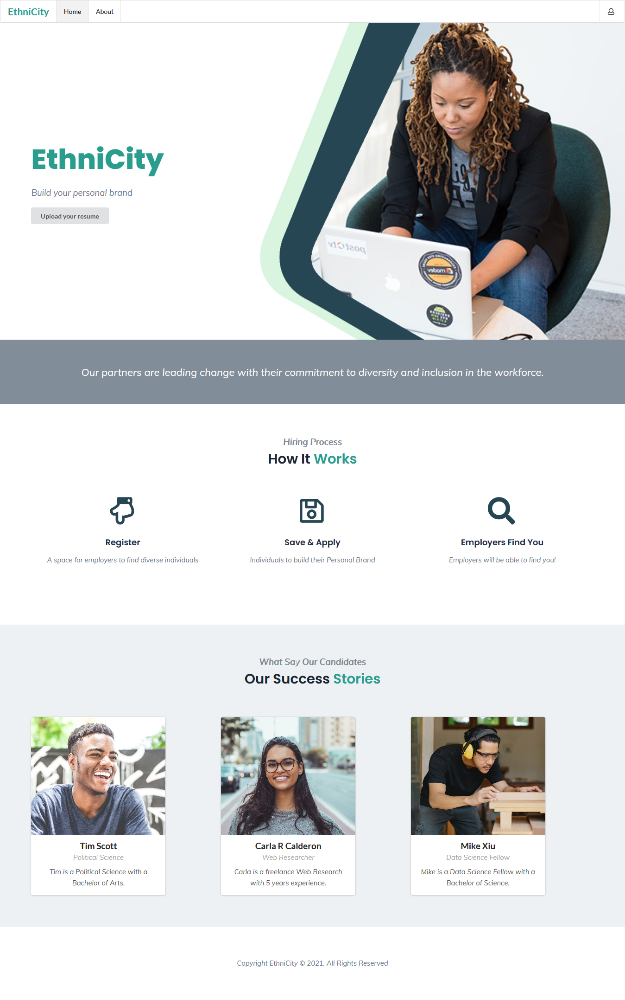

# ValTech-Social-Impact
Only work off of the dev branch 

- …or create a new repository on the command line
```
echo "# ValTech-Social-Impact" >> README.md
git init
git add README.md
git commit -m "first commit"
git branch -M main
git remote add origin https://github.com/HaxagonusD/ValTech-Social-Impact.git
git push -u origin main
```

- …or push an existing repository from the command line
```
git remote add origin https://github.com/HaxagonusD/ValTech-Social-Impact.git
git branch -M main
git push -u origin mai 
```

## GitHub Collaboration 
- Fork from the main repo
- Go to your computer directory and download a clone of the repo `git clone https://github.com/berryny/ValTech-Social-Impact.git`
- Display your branches `git branch`
- Create a second/separate branch `git checkout -b name_of_new_branch`
    - `git checkout -b social_impact`
- Display again your branches `git branch`. Do you see your new branch name?
- Push files to the secondary branch `git push origin social_impact`

## Henry Street Hotline

[Henry Street](https://www.henrystreet.org/) Helpline

In early April, the Henry Street Helpline launched to help anyone who needs individualized support or resources. Our Helpline is open from 10 a.m. to 2 p.m. and from 4 p.m. to 7 p.m. Monday through Friday, and is staffed by a team of 20+ social workers and case managers. Helpline staff can assist callers in obtaining food, accessing mental health services, secuREAring unemployment assistance and other benefits, and navigating any other crises. English, Spanish, and Mandarin speakers are available. We’ve answered more than 1,100 calls and counting; if you have a question, concern, or issue, give the Helpline a call at 347.493.2787.

## Hackathon Presentation

Challenge problems - [Google Docs](https://docs.google.com/presentation/d/1ou1FoqN-ZzJbSAMPYZSxkv9jKQq3Y2Y00TOGHxSCl6g/edit?usp=sharing)

## Technologies

- HTML/CSS/JavaScript
- Python
    - Flask
- React
    - Semantic UI React

### Design Tools

- Figma
- Canva

### Execute React

```
npm install
npm start
```

### OpenAI GPT-3

GPT-3 Sandbox: Turn your ideas into demos in a matter of minutes
[github repo](https://github.com/shreyashankar/gpt3-sandbox)


## Branches

- Project branches
    - `main` production
    - `dev ` team collaboration 

- Main Project Repo
    - HaxagonusD / ValTech-Social-Impact

- Folk from Main Repo
    - @berryny / ValTech-Social-Impact
    - @clarizamayo / ValTech-Social-Impact
    - @RakMirza / ValTech-Social-Impact
    - @jperalta7 / ValTech-Social-Impact

### LocalHost

- http://localhost:3000/
